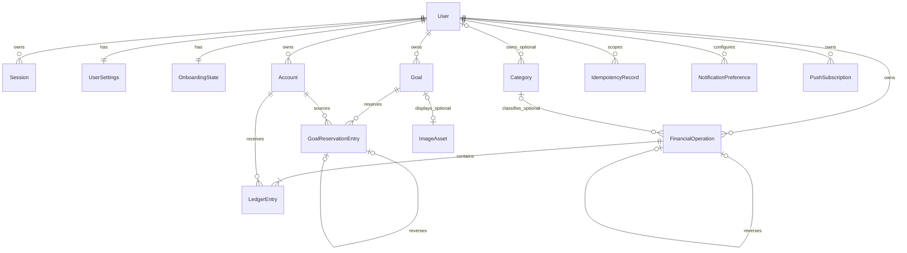

# Доменная модель PWA «Копилка»

## Статус и назначение

Документ изначально зафиксировал смысл сущностей и операций до написания Prisma schema и остаётся контрактом для application services, финансовых тестов и UI read models. Prisma schema и реальные PostgreSQL migrations теперь существуют; fresh apply, SQL constraints, идемпотентный system-category seed, atomic transfer lifecycle, Goal reserve limits и goal completion проверены application services и integration-тестами. При этом наличие таблиц само по себе не считается доказательством ещё не реализованных инвариантов. Имена полей могут быть адаптированы к ограничениям Prisma, но семантика и инварианты сохраняются.

## 1. Словарь домена

- **Капитал** — сумма ledger-балансов всех счетов пользователя, включая архивные счета с остатком.
- **Баланс счёта** — сумма неизменяемых `LedgerEntry` этого счёта.
- **Хотелка / Goal** — финансовая цель, которая сама по себе не содержит новых денег.
- **Резерв** — виртуально закреплённая за целью часть существующих денег.
- **Свободные деньги** — капитал минус активный резерв.
- **Доступно на счёте** — ledger-баланс счёта минус резерв, связанный с этим счётом, с учётом политики типа счёта.
- **FinancialOperation** — одно объяснимое бизнес-событие: доход, расход, перевод, открытие, корректировка, покупка цели или компенсация.
- **LedgerEntry** — подписанное изменение ledger-баланса одного счёта.
- **GoalReservationEntry** — подписанное изменение виртуального резерва; не является движением денег по счёту.
- **Компенсация / Reversal** — новая операция с проводками, противоположными ранее опубликованной операции.
- **Idempotency key** — идентификатор команды, не позволяющий применить одну мутацию дважды.

## 2. Карта сущностей



Составные внешние ключи `(entityId, userId)` применяются для account/operation/goal/image ownership и self-reference reversal/supersession, чтобы БД отклоняла cross-user связи независимо от application service.

## 3. User

Назначение: корень ownership и authentication identity.

Поля:

- `id` — устойчивый непрогнозируемый идентификатор;
- `loginNormalized` — уникальный нормализованный логин;
- `loginDisplay` — исходная безопасная форма для UI;
- `passwordHash` — Argon2id hash;
- `displayName`;
- `baseCurrency` — код валюты пользователя;
- `createdAt`, `updatedAt`;
- `disabledAt` — optional, для безопасного отключения без потери истории.

Инварианты:

- login уникален после нормализации;
- passwordHash никогда не входит в публичный DTO;
- baseCurrency не меняется с неявной конвертацией существующей истории;
- удаление User не должно случайно оставить бесхозные финансовые данные.

## 4. UserSettings

Поля:

- `userId` — PK/FK;
- `monthlyIncomeMinor` — bigint, неотрицательный;
- `mandatoryMonthlyExpensesMinor` — bigint, неотрицательный;
- `timeZone` — IANA timezone;
- `theme` — `SYSTEM | LIGHT | DARK`;
- `privacyModeDefault` — optional server preference; локальный toggle допустим отдельно;
- `createdAt`, `updatedAt`.

Расчёт:

```text
availableMonthly = max(monthlyIncomeMinor - mandatoryMonthlyExpensesMinor, 0)
```

## 5. Session

Поля:

- `id`;
- `userId`;
- `tokenHash` — unique, raw token не хранится;
- `createdAt`;
- `lastSeenAt`;
- `expiresAt`;
- `revokedAt`;
- optional безопасные metadata для security-аудита без хранения лишних персональных данных.

Валидная session не истекла и не отозвана. Login/password change создают новую session и предотвращают fixation. Logout отзывает серверную запись и очищает cookie/offline snapshot.

## 6. AuthAttempt / RateLimitBucket

Назначение: production-safe rate limiting без зависимости от памяти одного процесса.

Поля зависят от выбранного алгоритма, но содержат:

- нормализованный subject hash и/или network bucket;
- action scope: registration/login/password-change;
- window/tokens/counters;
- `blockedUntil`;
- timestamps.

Нельзя хранить plaintext password. Ответы не должны позволять перебором определить существование логина.

## 7. OnboardingState

Поля:

- `userId` — PK/FK;
- `currentStep`;
- `firstAccountCompletedAt`;
- `budgetCompletedAt`;
- `goalStepCompletedAt`;
- `goalStepSkippedAt`;
- `completedAt`;
- `updatedAt`.

Состояние хранится серверно. Каждый шаг идемпотентен. `completedAt` устанавливается только после существования валидного первого счёта и сохранения обязательных настроек; goal разрешено явно пропустить.

## 8. Account

Типы:

- `DEBIT_CARD`;
- `CREDIT_CARD`;
- `CASH`;
- `SAVINGS`;
- `BANK_ACCOUNT`;
- `CUSTOM`.

Поля:

- `id`, `userId`;
- `name`;
- `type`;
- `currency`;
- `visualTheme`;
- `last4` — optional, ровно четыре безопасных символа/цифры по принятой validation;
- `creditLimitMinor` — optional bigint, только для credit account;
- `archivedAt`;
- `createdAt`, `updatedAt`.

Не хранятся полный номер карты, CVV/CVC, PIN или банковские credentials.

Инварианты:

- account currency соответствует base currency в первой версии;
- opening balance оформляется операцией, а не полем `balance`;
- при нулевом opening balance создаётся только Account: пустая operation и нулевая entry не создаются;
- архивный счёт не принимает новые обычные операции;
- архивный остаток продолжает входить в capital;
- счёт с ненулевым активным резервом нельзя архивировать до освобождения резерва;
- физическое удаление счёта с финансовой историей запрещено.

`last4` разрешён только для `DEBIT_CARD | CREDIT_CARD`; полного номера карты в DTO и модели нет, а name validation отклоняет строку с 12 и более цифрами как возможный PAN. Обычное редактирование меняет только `name`, `visualTheme`, `last4` и, для credit account, `creditLimitMinor`. `type` и `currency` неизменяемы, чтобы не переинтерпретировать опубликованную историю. Уменьшение credit limit не может сделать уже существующий долг недопустимым.

Производные значения:

```text
balance = sum(ledger entries)
reserved = sum(open goal reservation entries by sourceAccountId)
available = balance - reserved
```

Для `DEBIT_CARD`, `CASH`, `SAVINGS`, `BANK_ACCOUNT` и `CUSTOM` требуется `available >= 0`. Для credit account:

```text
ownAvailable = balance - reserved
spendingCapacity = ownAvailable + creditLimitMinor
minimumBalance = -creditLimitMinor
reserved <= max(balance, 0)
```

Отрицательный balance означает долг. `creditLimitMinor = null` эквивалентен нулевому лимиту. Лимит учитывается только при проверке допустимого долга/spending capacity, не прибавляется к balance, capital или free money и не может резервироваться на цель.

Server-only реализация находится в `src/server/accounts`. Таблица `Account` не содержит ни `balance`, ни cached-balance поля: balance, capital, reserved, available и spending capacity каждый раз выводятся из ledger/reservation entries. Application service принимает уже доверенный authenticated `userId`, но единственный session-bound facade `current-user.ts` всегда выводит его из server-side cookie → DB session; client `userId` отсутствует во всех DTO. Чтения и мутации scoped по `(accountId, userId)`, поэтому чужой и несуществующий id возвращают одинаковый `ACCOUNT_NOT_FOUND`. Create, reconcile, update, archive и safe delete выполняются в Serializable transaction; create/reconcile дополнительно защищены user-scoped idempotency key и canonical request hash.

## 9. Category

Типы: `INCOME | EXPENSE`.

Поля:

- `id`;
- `ownerUserId` — nullable для system category;
- `kind`;
- `slug`;
- `labelRu`;
- `iconName` — ссылка на собственную AppIcon system;
- `sortOrder`;
- `archivedAt`;
- timestamps.

System categories — глобальные read-only записи с `ownerUserId = null` и стабильными slug. В production их идемпотентно материализует runtime ensure с уникальным partial index `(kind, slug) WHERE ownerUserId IS NULL`; `prisma/seed.ts` остаётся только dev-инструментом и не является production-зависимостью. Ensure сверяет не количество строк, а полный canonical catalog, восстанавливает отсутствующие записи и канонические `labelRu`/`iconName`/`sortOrder`/active state. Неизвестные устаревшие system rows сохраняются ради возможной исторической ссылочной целостности, но не выдаются query API и не принимаются для новых операций. Пользовательская категория доступна только владельцу. Тип категории обязан соответствовать виду операции; `CategoryReadModel.iconName` ограничен типом собственного `AppIconName`.

Income defaults:

`salary`, `side-job`, `gift`, `sale`, `refund`, `bonus`, `other-income`.

Expense defaults:

`groceries`, `transport`, `cafe`, `housing`, `subscriptions`, `entertainment`, `clothes`, `health`, `education`, `tech`, `gifts`, `travel`, `other-expense`.

## 10. FinancialOperation

Типы:

- `INCOME`;
- `EXPENSE`;
- `TRANSFER`;
- `OPENING_BALANCE`;
- `BALANCE_ADJUSTMENT`;
- `GOAL_PURCHASE`;
- `REVERSAL`.

Поля:

- `id`, `userId`;
- `type`;
- `categoryId` — только для допустимых income/expense/purchase случаев;
- `goalId` — optional для goal purchase;
- `note`;
- `occurredAt` — UTC instant;
- `reversesOperationId` — optional unique link;
- `supersedesOperationId` — optional link для edit chain;
- `idempotencyRecordId` либо эквивалентная связь;
- `createdAt`;
- optional `createdBySessionId` для аудита без раскрытия токена.

Операция после commit неизменяема. User-facing edit создаёт reversal и replacement. User-facing delete/cancel создаёт reversal. История показывает связь простым языком.

Правила количества проводок:

| Тип | Основные LedgerEntry |
|---|---:|
| INCOME | 1 положительная |
| EXPENSE | 1 отрицательная |
| TRANSFER | 2: равные `-source` и `+destination` |
| OPENING_BALANCE | 1 подписанная |
| BALANCE_ADJUSTMENT | 1 подписанная delta |
| GOAL_PURCHASE | 1 отрицательная |
| REVERSAL | точные противоположности исходной операции |

## 11. LedgerEntry

Поля:

- `id`;
- `userId`;
- `operationId`;
- `accountId`;
- `amountMinor` — signed bigint, не ноль;
- `role` — optional `PRIMARY | TRANSFER_SOURCE | TRANSFER_DESTINATION | REVERSAL`;
- `createdAt`.

Инварианты:

- entry после commit не обновляется и не удаляется;
- operation/account принадлежат тому же user;
- transfer entries имеют одинаковый absolute amount и сумму ноль;
- reversal entries дают ноль в сумме с исходными entries;
- финансовые агрегаты используют ledger, а не client state или поле account balance.

## 12. Goal

Категории:

`TECH`, `TRAVEL`, `CAR`, `HOUSING`, `EDUCATION`, `GIFT`, `CLOTHES`, `HEALTH`, `HOBBY`, `EMERGENCY_FUND`, `OTHER`.

Приоритеты: `HIGH | MEDIUM | LOW`.

Статусы:

- `ACTIVE`;
- `COMPLETED`;
- `ARCHIVED` или `CANCELLED` — конкретное отображение уточняется, но резерв закрыт;
- физическое удаление после финансовой истории запрещено.

Поля:

- `id`, `userId`;
- `name`, `category`, `description`;
- `targetAmountMinor` — bigint > 0;
- `targetDate` — optional calendar date;
- `priority`;
- `status`;
- `imageAssetId` — optional;
- `completedAt`;
- `actualPurchaseAmountMinor` — optional;
- `archivedAt`;
- `createdAt`, `updatedAt` для изменяемых нефинансовых metadata.

`currentReservedAmount` не хранится как независимая истина. Он всегда выводится из reservation ledger.

Реализовано (`src/lib/goals/catalog.ts`, `src/server/goals/*`, `src/server/actions/goals.ts`): типобезопасный каталог, strict validation, create/update/get/list/archive/restore под ownership, session-derived `userId`, same-origin mutation actions, Serializable + `FOR UPDATE` row lock + P2034 retry (включая 40001/40P01 в raw-запросах через driverAdapterError) и user-scoped idempotency. Create не создаёт ни `FinancialOperation`, ни `LedgerEntry`; при `initialReservation` той же транзакцией создаётся объяснимая запись `INITIAL_RESERVE` в reservation ledger с проверкой availability источника. Отдельного поля «уже накоплено» нет. `actualPurchaseAmountMinor`/`completedAt` заполняются только флоу завершения цели и делают цель read-only (`GOAL_NOT_EDITABLE`/`GOAL_NOT_RESTORABLE`). PostgreSQL lifecycle CHECK согласует status и timestamps, а `goals_completed_immutable_trigger` запрещает любое последующее изменение завершённой цели даже в обход application service.

## 13. GoalReservationEntry

Виды:

- `INITIAL_RESERVE`;
- `CONTRIBUTION`;
- `WITHDRAWAL`;
- `RELEASE_ON_COMPLETION`;
- `RELEASE_ON_ARCHIVE`;
- `REVERSAL`.

Поля:

- `id`, `userId`;
- `goalId`;
- `sourceAccountId`;
- `type`;
- `amountMinor` — signed bigint, не ноль;
- `note`;
- `occurredAt`;
- `reversesEntryId` — optional;
- `idempotencyRecordId` либо связь с общей командой;
- `createdAt`.

Производные значения:

```text
goalReserved(goal) = sum(entries by goal)
accountReserved(account) = sum(entries by source account for open reservations)
```

После каждой команды сумма по цели и счёту должна оставаться допустимой. Записи неизменяемы; исправление выполняется компенсирующей записью.

## 14. ImageAsset

Поля:

- `id`, `userId`;
- `storageKey` — server-generated;
- `mimeType` — только `image/png`, `image/jpeg`, `image/webp`;
- `byteSize`, `width`, `height`;
- optional integrity hash;
- `createdAt`, `deletedAt`.

Filename пользователя не является storage key. Goal может ссылаться только на asset своего user. Пользовательский SVG запрещён. Удаление/замена должны предотвращать orphan files.

## 15. IdempotencyRecord

Поля:

- `id`, `userId`;
- `scope`;
- `key`;
- `requestHash`;
- `state` — `PROCESSING | COMPLETED | FAILED_RETRYABLE` либо минимальный эквивалент;
- `resourceType`, `resourceId`/безопасный result snapshot;
- `createdAt`, `completedAt`, `expiresAt`.

Constraint: unique `(userId, scope, key)`.

Result не содержит секретов; bigint сериализуется строкой. Одинаковый key с иным request hash является conflict.

## 16. NotificationPreference и PushSubscription

`NotificationPreference`:

- `userId`;
- weekly reminder enabled/day/time;
- near-goal enabled;
- goal-completed enabled;
- timestamps.

`PushSubscription`:

- `id`, `userId`;
- endpoint и public subscription keys в защищённом серверном хранилище;
- `expiresAt`, `revokedAt`, timestamps.

Push optional и не ломает core app без VAPID. Разрешение запрашивается только после контекстного действия пользователя.

## 17. Основные команды

Каждая команда получает authenticated context, validation DTO и idempotency key для финансовых мутаций.

### CreateAccount

В одной Serializable transaction создаёт idempotency record и Account. При ненулевом opening amount в той же transaction создаёт ровно одну `OPENING_BALANCE` operation и одну `PRIMARY` entry. При нуле не создаёт ни operation, ни entry: это исключает пустое бизнес-событие и не нарушает запрет нулевых ledger entries. Повтор `(userId, account.create, key)` с тем же canonical request hash возвращает тот же Account; другой payload даёт conflict.

### AddIncome / AddExpense

Создают operation и одну entry. Expense проверяет доступные средства внутри transaction после account lock.

Ограничения реализации (2026-08-11):
- `amountMinor` — bigint от 1 до `MAX_MONEY_MINOR`; income postит положительную entry, expense — отрицательную.
- `occurredAt` принимается в пределах горизонта: не позднее 31 дня в будущее и не ранее 366 дней в прошлое от серверного `now` (`DATE_OUT_OF_RANGE` вне горизонта).
- Категория обязана существовать, быть не архивной и принадлежать пользователю либо быть системной с соответствующим `kind` (`CATEGORY_NOT_FOUND`).
- Проверки после применения суммы: для не-кредитного счёта `balance − reserved ≥ 0`, для кредитного `balance ≥ −creditLimitMinor`; при невыполнении — `INSUFFICIENT_AVAILABLE_FUNDS` / `CREDIT_LIMIT_EXCEEDED`. Income разрешён на кредитный счёт и уменьшает долг.
- Создание идемпотентно в осмысленности повтора сетевого запроса, но не «нейтрально к данным»: тот же `(userId, operation.create, key)` с другим canonical request hash возвращает `IDEMPOTENCY_CONFLICT`, а не молчаливый no-op; невозвратные ответы не отменяют учёт (money ruling). Canonical hash нормализует UUID и `occurredAt` до UTC instant, поэтому эквивалентные ISO-offset записи считаются одним запросом. Уже завершённый result replay проверяется до изменяемого date-horizon правила: поздний сетевой повтор возвращает исходную операцию и никогда не создаёт новую проводку.

### Transfer

`CreateTransfer` принимает положительный `amountMinor`, разные source/destination, comment, UTC-capable `occurredAt` и idempotency key. `userId` отсутствует в DTO и выводится session-bound facade. В одной Serializable transaction сервис:

1. блокирует оба owned Account в стабильном порядке UUID;
2. требует активные счета одной валюты;
3. повторно вычисляет ledger balance и reserve source;
4. проверяет `available >= amount` либо credit debt floor;
5. создаёт один `TRANSFER` header, отрицательную `TRANSFER_SOURCE` и равную положительную `TRANSFER_DESTINATION` entry;
6. завершает user-scoped idempotency record.

PostgreSQL deferred constraint trigger проверяет финальное состояние transaction: transfer обязан иметь ровно две проводки правильных ролей/знаков и сумму ноль. Поэтому header без пары либо одиночная entry откатывают всю transaction даже при обходе application service. Параллельные команды сериализуются; retry разрешён только для `P2034`, SQLSTATE `40001` и `40P01`.

`EditTransfer` не изменяет опубликованные строки. Под lock исходного header и всех старых/новых счетов одна transaction создаёт двухсторонний `REVERSAL`, затем новый `TRANSFER` с `supersedesOperationId`. Проверка средств применяется к итоговым aggregate deltas после reversal + replacement. `CancelTransfer` создаёт только двухсторонний reversal; если destination уже потратил полученные средства и компенсация нарушила бы account floor/reserve, отмена отклоняется. Archived original accounts разрешены только как участники компенсации; новые source/destination при edit обязаны быть активными. Повтор lifecycle-команды возвращает сохранённые operation ids, а competing edit/cancel одного active transfer допускает ровно одного победителя.

### ReconcileAccount

Блокирует owned Account через `SELECT … FOR UPDATE`, повторно вычисляет balance/reserved и проверяет account policy внутри Serializable transaction. Затем вычисляет `delta = actualBalance - ledgerBalance`. При ненулевой delta создаёт ровно одну `BALANCE_ADJUSTMENT` operation и одну `PRIMARY` entry; при нуле сохраняет завершённый idempotency result и возвращает no-change без фиктивных финансовых строк. Serialization conflicts повторяются ограниченно, business errors не повторяются.

### Update / Archive / Delete Account

- Update меняет только безопасные metadata и не трогает ledger.
- Archive выполняется под account lock, идемпотентен и запрещён при outstanding reserve; balance/history сохраняются и продолжают входить в capital.
- Delete выполняется под lock и допустим только при полном отсутствии `LedgerEntry` и `GoalReservationEntry`; связанные create idempotency records удаляются вместе с пустым ресурсом.
- FK `RESTRICT` остаются последней защитой от orphan entries/operations при ошибочном прямом delete.

### EditOrCancelOperation

Для transfer реализовано: cancel создаёт одну reversal operation с двумя противоположными entries; edit в одной transaction создаёт такую reversal и replacement transfer. Исходные ledger rows неизменяемы, а связи `reversesOperationId`/`supersedesOperationId` сохраняют объяснимую цепочку. Общий lifecycle для income/expense и goal purchase остаётся отдельным этапом.

### CreateGoal

Создаёт Goal. Initial reserve, если указан, выполняется той же transaction через lock исходного account: `initialReservation` создаёт запись `INITIAL_RESERVE` и возвращает её id; недостаток свободных средств — `INSUFFICIENT_ACCOUNT_AVAILABLE`, чужой/архивный счёт — `ACCOUNT_NOT_FOUND`/`ACCOUNT_ARCHIVED`, откат откатывает и goal. Replay с тем же ключом и payload возвращает сохранённый результат, конфликтующий payload — `IDEMPOTENCY_CONFLICT`, незавершённый запрос — `IDEMPOTENCY_IN_PROGRESS`.

### Contribute / WithdrawGoalReserve

Создают reservation entry после блокировки goal/account (порядок goal → account, `FOR UPDATE`) и проверки допустимых сумм. Capital и ledger не меняются: `CONTRIBUTION` (+amount) уменьшает free money цели, `WITHDRAWAL` (−amount) возвращает резерв источнику. Ограничения: contribute не больше свободных средств счёта (для кредитной карты — floor `max(balance, 0)`), withdraw не больше резерва цели на этом счёте (`INSUFFICIENT_GOAL_RESERVE`), архивный счёт/цель и completed goal отклоняются (`ACCOUNT_ARCHIVED`/`GOAL_NOT_ACTIVE`), cross-user source — как missing. Канонический hash по scope+payload, PROCESSING→COMPLETED idempotency с replay и concurrent double tap; serialization conflicts ретраятся.

### CompleteGoal

Закрывает весь reserve и создаёт один purchase expense атомарно, затем переводит Goal в completed.

### ArchiveGoal

Для active goal атомарно освобождает reserve и архивирует. Completed goal уже имеет закрытый reserve.

Реализовано: archive допустим только для ACTIVE и при нулевом открытом резерве (`ACTIVE_RESERVATION` иначе); история резервов сохраняется. Restore возвращает в ACTIVE только архивированную цель без completedAt/actualPurchaseAmount и с закрытым резервом; completed или с открытым резервом — `GOAL_NOT_RESTORABLE`. Contribute/WithdrawGoalReserve реализованы; CompleteGoal остаётся отдельным этапом.

## 18. Расчёт плана цели

Обозначения:

```text
T = target amount
C = current reserved
R = max(T - C, 0)
D = target calendar date
```

Результат чистого calculator:

- remaining amount;
- progress, включая overfunded;
- days/weeks remaining;
- weekly и approximate monthly contribution;
- feasibility относительно `availableMonthly`;
- no-date сценарии 10/20/30%;
- projected date при заданном monthly contribution;
- emergency fund ориентиры 3/6 месяцев обязательных расходов.

Фактический чистый API находится в `src/lib/goals/calculations.ts` и зависит только от `src/lib/money` и `src/lib/dates`. UI, Prisma, server state и скрытый clock отсутствуют. Caller передаёт уже вычисленный в timezone пользователя календарный `today`, поэтому одинаковый input всегда даёт одинаковый output.

Точные правила:

```text
progressBasisPoints = floor(C × 10_000 / T)
planningDays = calendarDifference(today, D) + 1
weekly = ceil(R × 7 / planningDays)
currentWeek = ceil(R × currentWeekDays / planningDays)
monthlyApprox = ceil(weekly × 52 / 12)
availableMonthly = max(monthlyIncome - mandatoryExpenses, 0)
```

- `T` обязан быть положительным, `C` и остальные деньги — неотрицательные `bigint` minor units в диапазоне PostgreSQL `bigint`;
- raw progress сохраняет overfunded значение выше 100%, capped progress отдельно ограничен 100% для визуального индикатора;
- `planningDays` включает today и target date; today имеет один день для плана, past date — ноль и явный status;
- full week — понедельник–воскресенье; текущий незавершённый цикл включает today и заканчивается ближайшим воскресеньем либо target date, если она раньше;
- deadline today/past возвращает весь `R` во всех recommendation fields как сумму, нужную сейчас, и никогда не делит на ноль;
- все денежные рекомендации округляются вверх, поэтому сумма к сроку не оказывается ниже target;
- `comfortable` («комфортно»): monthly recommendation ≤ 50% `availableMonthly`; `strained` («напряжённо»): > 50%, но ≤ available; `unrealistic` («нереалистично»): > available; нулевая рекомендация комфортна;
- no-date варианты сохраняют честные 10/20/30% дохода и возвращают `isWithinAvailableBudget`, а не молча урезают невозможный вариант;
- projected date использует `ceil(R / monthlyContribution)` целых календарных месяцев и clamp конца месяца; при нулевом взносе дата отсутствует, а у уже достигнутой цели равна today;
- несколько целей суммируются без float и без смешения unscheduled целей с scheduled weekly/monthly totals;
- ориентиры финансовой подушки равны 3× и 6× обязательных месячных расходов и не являются персональным финансовым советом.

## 19. Read models

### DashboardReadModel

- greeting/display name/monogram;
- total capital и month change;
- reserved/free;
- быстрые финансовые действия;
- ссылка на полный список карт.

Account, goal plan и operation summaries остаются отдельными read models и routes. Они намеренно не дублируются на mobile home по принятому после визуального QA UX-решению.

### AccountDetailReadModel

- account metadata;
- balance, reserved и available;
- month inflow/outflow;
- chart points;
- recent operations;
- archive/reconcile capabilities.

`month inflow/outflow` использует локальный месяц из `UserSettings.timeZone`, преобразованный PostgreSQL в полуинтервал UTC `[monthStart, nextMonthStart)`, и фильтрует по `FinancialOperation.occurredAt`. Это gross signed movement конкретного счёта: income/expense/transfer/goal purchase/reversal входят по знаку entry, outflow возвращается положительным модулем; `OPENING_BALANCE` и `BALANCE_ADJUSTMENT` исключены как setup/correction и показываются в истории отдельно.

### GoalDetailReadModel

- goal metadata/image/placeholder;
- target/reserved/remaining/progress;
- target date, weekly/monthly plan и feasibility;
- contribution history;
- available actions;
- completion readiness.

### AnalyticsReadModel

- period;
- capital trend;
- income, expense, net cashflow;
- reserved/free;
- expense categories;
- accessible text summaries.

Read models не содержат password/session/storage secrets и не должны требовать загрузки всего ledger в браузер.

## 20. Ключевые сценарии состояния

### Перевод 10 000 между A и B

```text
До:  A=100 000, B=20 000, capital=120 000
Entries: A=-10 000, B=+10 000
После: A=90 000, B=30 000, capital=120 000
```

### Резерв 5 000

```text
До: capital=100 000, reserved=20 000, free=80 000
ReservationEntry=+5 000
После: capital=100 000, reserved=25 000, free=75 000
```

### Покупка при reserve 25 000 и цене 23 000

```text
Release reservation=-25 000
Expense ledger=-23 000
После: capital уменьшился на 23 000, reserved=0
Разница 2 000 стала free; второго expense нет
```

### Сверка 54 200 -> 53 870

```text
delta = -330
BALANCE_ADJUSTMENT entry = -330
История исходных операций не изменена
```

## 21. Constraints, которые обязаны подтверждаться тестами

1. Все money fields — bigint minor units.
2. `LedgerEntry.amountMinor != 0`.
3. `GoalReservationEntry.amountMinor != 0`.
4. `Goal.targetAmountMinor > 0`.
5. Доход/расход используют категорию правильного типа.
6. Transfer source и destination различаются и принадлежат одному user.
7. Transfer entry sum равна нулю.
8. Reserve и goal/account принадлежат одному user.
9. Goal reserve никогда не становится отрицательным.
10. Active account reserve не превышает допустимые собственные средства.
11. Completed/archived goal не имеет открытого reserve.
12. Idempotency tuple уникален.
13. Reversal нельзя применить к одной operation более одного раза без отдельного обоснованного chain.
14. Cross-user composite references невозможны.
15. Никакая отмена не удаляет опубликованные ledger rows.

## 22. Статус решений Prisma/PostgreSQL

Подтверждено migration и fresh database:

- composite foreign keys `(entityId, userId)` для account/operation/goal/image ownership;
- composite self-reference foreign keys для operation reversal/supersession и reservation reversal;
- PostgreSQL `CHECK` constraints для nonzero/positive money, sign-policy резервов и enum-specific metadata;
- partial unique index системных категорий и partial indexes активных sessions/accounts/goals;
- `targetDate` хранится как PostgreSQL `date`, а operation/reservation timestamps — `timestamptz`;
- базовые индексы пользовательских выборок по датам, счетам, категориям и целям, а также FK-side indexes для auth attempts, operation categories и supersession.
- deferred PostgreSQL constraint triggers для ровно двух сбалансированных transfer entries и двухстороннего transfer reversal.

Подтверждено application services и integration/concurrency tests:

- стабильный порядок multi-row locks для account/operation/transfer/goal flows;
- reserve limits, credit floor и completion invariants внутри Serializable transactions;
- user/date/account/category/goal indexes используются scoped read models; дальнейшие индексы добавляются только по production query plans, а не заранее.

Если ORM не выражает constraint, он добавляется SQL migration и покрывается integration-тестом; constraint не исключается ради удобства ORM.
